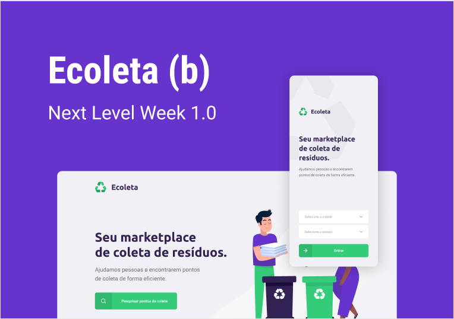

# Ecoleta_NLW-01
Front, back e mobile do app Ecoleta desenvolvido durante a NextLevelWeek#01

  

Ecoleta é um app feito para conectar pessoas a pontos de coleta de resíduos. Na inteface web é possível cadastrar um ponto de coleta, com informações gerais como nome e foto, localização, contato e os itens que este ponto coleta. Já a inteface mobile se encarrega de listar os pontos cadastrados de acordo com a proximidade ao usuário e os resíduos que ele deseja descartar. Toda a aplicação foi construída utilizando TypeScript, junto ao Node, React e React Native.

## Backend
A API foi construída com NodeJS e servidor é o Express. O banco de dados é o SQLite3 mas utilizei o Knex, interface para gerenciamento de persistência, que pode ser configurado para se adaptar a qualquer SGBD. A validação dos dados recebidos via FormData são feitas com o Celebrate e as imagens anexadas são renomeadas e armazenadas na pasta "uploads", que foi configurada como uma endpoint para servir arquivos estáticos. O backend ainda conta com serialização dos dados, provendo apenas o necessário para o funcionamento das interfaces web e mobile.

## Web
A interface Web do Ecoleta foi construída com ReactJS. Ela consome a api de localidades do IBGE para obter UFs e cidades que serão dispostos em dropboxes. Faz uso também da API do Leaflet para fornecer um mapa onde o usuário é capaz de selecionar a localização exata do ponto de coleta. O upload da imagem do estabelecimento é possível por conta da integração com o react-dropzone, e todos os dados por fim são enviados ao backend por meio de um MultipartFormData.

## Mobile
Por fim temos ReactNative no app mobile. Nele temos uma integração para mapas, envio de email e whatsapp providos pelo react-native-maps, expo-mail-composer e o módulo Linking do próprio react-native, respectivamente. O usuário encontra facilmente um ponto de coleta dos resíduos que deseja descartar e consegue entrar em contato com o tal ponto com apenas um toque.
